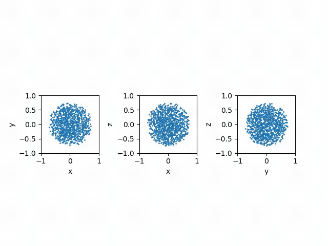

# 3D SPH Toy Star Simulation

A three-dimensional particle-based hydrodynamics simulation of a polytropic toy star implemented in Python using **Smoothed Particle Hydrodynamics (SPH)**.

The model represents the stellar fluid using discrete particles and computes local fluid properties through an SPH smoothing kernel. Starting from a randomly distributed spherical configuration that is not initially in hydrostatic equilibrium, the system expands and undergoes damped oscillations before approaching an equilibrium configuration.

The project provides a compact implementation of several fundamental concepts in computational fluid dynamics and particle-based numerical modelling, including SPH density estimation, pressure-gradient forces, kernel interpolation, adaptive timesteps, and second-order time integration.

---

## Physical Model

The star is represented by $N$ particles distributed randomly within a sphere of radius $R$.

Each particle has equal mass

```math
m = \frac{M}{N},
```

where $M$ is the total mass of the model.

The initial particle positions are sampled uniformly throughout the volume of the sphere, while all particles initially have zero velocity.

The model assumes a **polytropic equation of state**

```math
P = K \rho^\gamma,
```

with

```math
\gamma = 1+\frac{1}{n},
```

where:

* $P$ is the pressure,
* $\rho$ is the density,
* $K$ is the polytropic constant,
* $n$ is the polytropic index.

For the default value $n=1$,

```math
\gamma = 2.
```

---

## Smoothed Particle Hydrodynamics

Smoothed Particle Hydrodynamics is a mesh-free Lagrangian method in which a continuous fluid is represented by a collection of particles.

Fluid quantities are reconstructed from neighbouring particles using a smoothing kernel.

### Density Estimation

The density associated with particle $i$ is estimated as

```math
\rho_i = \sum_j m_j W_{ij},
```

where $m_j$ is the mass of neighbouring particle $j$ and $W_{ij}$ is the smoothing kernel evaluated between particles $i$ and $j$.

Only particles separated by less than the smoothing length $h$ are considered neighbours in the implementation.

---

## SPH Kernel

The simulation uses a compact cubic B-spline kernel.

Defining

```math
q = \frac{r_{ij}}{h},
```

the three-dimensional kernel has the form

```math
W(r,h)=\frac{8}{\pi h^3}f(q),
```

with

```math
f(q)=
\begin{cases}
1-6q^2+6q^3, & 0 \le q < \frac{1}{2},\\
2(1-q)^3, & \frac{1}{2}\le q <1,\\
0, & q\ge1.
\end{cases}
```

The compact support of the kernel means that particles only interact hydrodynamically with nearby particles.

The spatial derivatives of the kernel are used to calculate the SPH pressure force.

---

## Equations of Motion

The hydrodynamic pressure acceleration of particle $i$ is calculated using the symmetric SPH expression

```math
\mathbf{a}_{i,\mathrm{pressure}}
=
-\sum_j m_j
\left(
\frac{P_i}{\rho_i^2}
+
\frac{P_j}{\rho_j^2}
\right)
\nabla_i W_{ij}.
```

In addition to the SPH pressure force, the toy-star model includes a simplified central restoring acceleration

```math
\mathbf{a}_{i,\mathrm{grav}}=-\lambda\mathbf{r}_i,
```

and a linear damping term

```math
\mathbf{a}_{i,\mathrm{damp}}=-\nu\mathbf{v}_i.
```

The complete acceleration is therefore

```math
\mathbf{a}_i
=
\mathbf{a}_{i,\mathrm{pressure}}
-\lambda\mathbf{r}_i
-\nu\mathbf{v}_i.
```

The central restoring term provides a simplified representation of gravitational confinement rather than calculating the full self-gravitational interaction between all particles.

The damping term progressively removes kinetic energy, allowing the initially perturbed particle distribution to relax toward an equilibrium configuration.

---

## Time Integration

Particle positions and velocities are evolved using a second-order **Verlet / leapfrog-type integration scheme**.

The velocity is first advanced by half a timestep,

```math
\mathbf{v}_{n+1/2}
=
\mathbf{v}_n
+
\frac{\Delta t}{2}\mathbf{a}_n,
```

followed by the position update,

```math
\mathbf{r}_{n+1}
=
\mathbf{r}_n
+
\Delta t\,\mathbf{v}_{n+1/2}.
```

The hydrodynamic quantities and accelerations are then recalculated at the new particle positions before completing the velocity update.

---

## CFL Timestep

The timestep is dynamically calculated from a Courant-type condition,

```math
\Delta t
=
C_{\mathrm{CFL}}
\frac{h}{\max(c_s)},
```

where $h$ is the smoothing length and $c_s$ is the local sound speed.

For the polytropic equation of state used here,

```math
c_s =
\sqrt{
\gamma K\rho^{\gamma-1}
}.
```

The timestep therefore adapts to changes in the hydrodynamic state of the system.

---

## Default Simulation

The default configuration is:

| Parameter               | Value |
| ----------------------- | ----: |
| Number of particles     |  1000 |
| Initial radius $R$      |  0.75 |
| Total mass $M$          |   2.0 |
| Polytropic index $n$    |   1.0 |
| Polytropic constant $K$ |   0.1 |
| Damping coefficient     |   0.1 |
| Smoothing length $h$    |   0.2 |
| CFL number              |   0.5 |
| Initial time            |     0 |
| Final time              |    40 |

Since the randomly generated initial particle distribution is not in equilibrium, the model initially expands.

The combination of the restoring force and pressure subsequently causes the particles to oscillate around the equilibrium configuration. The linear damping term progressively reduces the amplitude of these oscillations.

---

## Running the Simulation

The project requires:

* Python 3
* NumPy
* SciPy
* Matplotlib
* FFmpeg

Run the simulation with

```bash
python Toy_Star.py
```

The simulation parameters can be modified through the `toy_star()` function:

```python
toy_star(
    N=1000,
    R=0.75,
    M=2.0,
    n=1.0,
    k=0.1,
    damp=0.1,
    t0=0.0,
    tend=40.0,
    h=0.2,
    CFL=0.5,
    data_save=True
)
```

---

## Output

The simulation generates two complementary visualizations.

The first shows the particle distribution projected onto the three coordinate planes:

* $x-y$
* $x-z$
* $y-z$

The second shows the complete particle distribution in three dimensions.

The individual frames are automatically combined into MP4 animations using FFmpeg.

If `data_save=True`, the particle coordinates and velocities are additionally stored during the simulation for subsequent analysis.

---

## Example Simulation

[](media/toy_star.mp4)

A higher-quality MP4 version can also be included:

```markdown
[▶ Watch the full simulation](media/toy_star.mp4)
```

---

## Repository Structure

```text
.
├── Toy_Star.py
├── media/
│   ├── toy_star.gif
│   └── toy_star.mp4
├── README.md
└── LICENSE
```

---

## Model Limitations

This code is intended as a **toy model and educational implementation of SPH**, rather than a complete stellar hydrodynamics code.

In particular:

* gravity is represented by a prescribed central restoring force rather than self-consistent particle self-gravity,
* the smoothing length is fixed,
* the neighbour search uses a direct particle-pair search,
* the model includes an explicit damping force to drive relaxation,
* additional physics required for realistic stellar simulations is not included.

---

## Author

**Santiago Hernández Díaz**

PhD candidate in Physics
University of Tübingen

